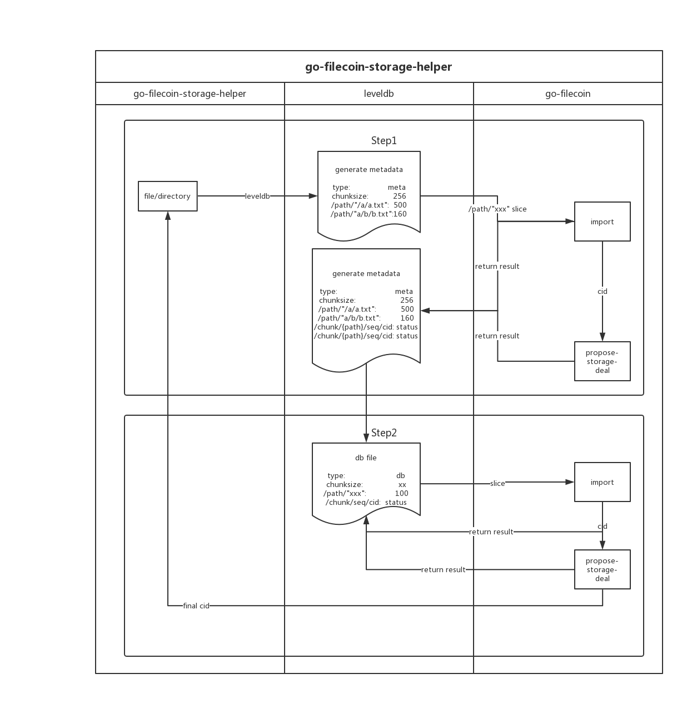

# Storage help workflow

### 1. storage workflow



### 2 Storage Introduction
- Step 1 
  - Input: user data
  - Output: meta data of user data 
  - workflow:
		- Record the directory tree to db (badger) through storage helper, including block size, type (if from user data or db), file path / size)
		- Import Filecoin for trading	
		- Get results from go-filecoin or lotus, including CID and transaction status
		- Record the CID and transaction status of the film into db, and record the CID relationship with the original file (the seq of the file and block)

- Input: Metadata database of user data
	- Output: DB's metadata database
	- Workflow:
		- If the DB of userdata's metadata is larger than the sector size, as shown in step 1, the DB is considered a file. Divide the database into many blocks. 

- Step 3
	- Repeat step 2 until the size of the database is smaller than the sector size. Then import the database, CID is the final result.

#### 2 Retrieval Introduction

- step 1 
	- Get database via cid
- Step 2
	- Determine whether it is a database for recording metadata, otherwise, repeat the steps until got the database for recording metadata
-	Step 3
	- Obtain source file data block through metadata cid
- Step 4
	- Assemble data blocks to form source files

### 3. Code
#### 3.1 import
- Struct of Metadata (meta/meta.go)
```
type MetaData struct {
    Name string				//file name
    DbName string			//db name of metadata
    Size   uint64			//size of input file
    Type string				//type of metadata：meta/db
    EncType string	 
    AbsPath string		
    IsDir   bool		
    Slices int				
    wg     sync.WaitGroup	
    Mstore *MetaStore
    SliceSize  uint64		
    Miner      string	
    StorageAPI api.API	
    // Vers       string
    dbNumb int
}


```

- For example, a\b is dir, a.txt and b.txt is files .

```
a :——
     |
     - a.txt
     |
     - b--
          |
          -b.txt
```
1. Create metadata：`NewMetaData()`
Get meta infomation of files.
2. traverse file：`traversefile()`
Depending on the type of file (single file / directory), different processing (processing of the main directory):
Here will traverse the directory, record all sub-files under the directory (database preservation)： key：/path/{abspath}；value：filesize
```
err := filepath.Walk(m.AbsPath, func(path string, info os.FileInfo, err error) error {
            if err != nil {
                return err
            }
            if info.IsDir() {
                return nil
            }
            //key: /path/{abspath}; value: size
            key := datastore.KeyWithNamespaces([]string{FilePrefix, path})
            if err := m.Mstore.DS.Put(key, []byte(strconv.FormatInt(info.Size(), 10))); err != nil {
                return xerrors.Errorf("saving path to metastore: %w", err)
            }
            return nil
        })
```
After following the above steps, our database saves the information about this file as follows:
```
type:	 	        meta
slices:		        {num}
enctype:	        aes/rsa
abspath:             /xx/xxx
chunksize:	        slicesize
/path/{filepath}:   filesize
/path/{filepath}:   filesize
```
3. `importFile()`
```
func (m *MetaData) importFile(ctx context.Context) (string, error) {
    files, err := m.Mstore.DS.Query(dsq.Query{Prefix: FilePrefix})
    if err != nil {
        return "", xerrors.Errorf("query file from metastore err: %w", err)
    }
    m.wg.Add(m.Slices)
    for {
        f, ok := files.NextSync()
        if !ok {
            break
        }
        //f.Key: "/path/{abspath}"
        fpath := strings.TrimPrefix(f.Key, FilePrefix)
        fsize, err := strconv.ParseUint(string(f.Value), 10, 64)
        if err != nil {
            return "", xerrors.New("invalid filesize")
        }
		//大文件的拆分
        if fsize &gt; m.SliceSize {
            go m.slicefile(ctx, fpath, fsize, &amp;m.wg)
            continue
        }
        chunk := &amp;chunk{
            sequence:     1,
            absPath:      fpath,
            tempfilepath: fpath,
        }

        go m.importchunk(ctx, chunk, &amp;m.wg)
    }
    m.wg.Wait()
    m.Mstore.DS.Close()
    cid, err := m.handlerdb(ctx)
    if err != nil {
        return "", err
    }
    return cid, nil
}
```
4. `slicefile()`
```
func (m *MetaData) slicefile(ctx context.Context, fpath string, fsize uint64, wg *sync.WaitGroup) error {
    fi, err := os.OpenFile(fpath, os.O_RDONLY, os.ModePerm)
    if err != nil {
        return err
    }

    num := utils.ComputeChunks(fsize, m.SliceSize)
    b := make([]byte, m.SliceSize)
    var i int64 = 1
    for ; i &lt;= int64(num); i++ {

        fi.Seek((i-1)*(int64(m.SliceSize)), 0)

        if len(b) &gt; int((int64(fsize) - (i-1)*int64(m.SliceSize))) {
            b = make([]byte, int64(fsize)-(i-1)*int64(m.SliceSize))
        }

        fi.Read(b)

        timestamp := strconv.FormatInt(time.Now().Unix(), 10)
        fname := timestamp + strings.Replace(fpath, "/", "_", -1) + strconv.FormatInt(i, 10)
        tempfilepath := filepath.Join(TempFiledir, fname)

        f, err := os.OpenFile(tempfilepath, os.O_CREATE|os.O_WRONLY, os.ModePerm)
        if err != nil {
            log.Errorf("generate tempfile failed, fpath: %s, err: %+v", fpath, err)
        }

        f.Write(b)
        f.Close()
        c := &amp;chunk{
            sequence:     int(i),
            absPath:      fpath,
            tempfilepath: tempfilepath,
        }
key：/chunk/{filepath}；value：cid
        go m.importchunk(ctx, c, wg)
    }

    return nil
}
```
5. At this time, we have already saved the metadata related information to the database, and now we need to save the database that records the metadata, namely handlerdb ()`
```
func (m *MetaData) handlerdb(ctx context.Context) (string, error) {

    dbgzpath, err := m.compressdb(ctx)
    if err != nil {
        return "", xerrors.Errorf("compressdb err: %w", err)
    }
    m.Mstore.DS.Close()

    dbgzinfo, _ := os.Stat(dbgzpath)
    dbgzsize := dbgzinfo.Size()

    var cid string
    if uint64(dbgzsize) &gt; m.SliceSize {
        dbmeta, err := m.generatedbmeta(ctx, dbgzpath)
        if err != nil {
            return "", xerrors.Errorf("generatedbmeta err:", err)
        }

        if err := dbmeta.traversefile(ctx); err != nil {
            return "", err
        }

        return dbmeta.importFile(ctx)
    }

    cid, err = m.importdb(ctx)
    if err != nil {
        return "", xerrors.Errorf("importdb failed: %w", err)
    }

    return cid, nil
}
```
`
#### 3.2 deal
- Struct
```
type Deal struct {
    Miner      string
    Cid        string
    AskID      string
    Price      string
    Duration   int64
    WalletAddr string
    Dstore     *MetaStore
    StorageAPI api.API
}
```
- `StorageDeal()`
```
func (d *Deal) StorageDeal(ctx context.Context, cid string) (*api.DealStatus, error) {
    //If have placed an order before,
    //can re-order the failed order
    if d.isReOrder(ctx, cid) {
        // log.Infof("check failed deal, file cid: %s", cid)
        d.handleFailedDeal(ctx)
    } else {
        ds := api.DealStatus{}
        dealenc, _ := json.Marshal(&amp;ds)
        if err := d.Dstore.DS.Put(datastore.NewKey(cid), dealenc); err != nil {
            return nil, xerrors.Errorf("failed put cid to store:", err)
        }

        if err := d.getFileCids(ctx, cid); err != nil {
            //delete the dbfile of deal
            // utils.RemoveFileOrDir(dbpath)
            return nil, err
        }

        d.Startdeal(ctx)
        incommingdeal &lt;- d
    }

    dealresp := &amp;api.DealStatus{}
    if len(d.Dstore.FailedDeals) &gt; 0 {
        dealresp.State = Failed
    } else {
        dealresp.State = Accepted
        // dealresp.DealId = dealid
    }

    return dealresp, nil
}
```

1. `getFileCids()`
```
func (d *Deal) getFileCids(ctx context.Context, cid string) error {
    repopath, ok := ctx.Value(repo.CtxRepoPath).(string)
    if !ok {
        return xerrors.New("ctx value repopath not found")
    }
    destdbpath := filepath.Join(repopath, repo.MetaDir)
    dir, err := ioutil.ReadDir(destdbpath)
    if err != nil {
        return err
    }

    for _, fi := range dir {
        if strings.HasPrefix(fi.Name(), cid) {
            d.flushcidtodb(ctx, fi.Name())
        }
    }

    return nil
}
```
	Method `flushcidtodb()`,put deal ids to db,key: cid；value: DealStatus{state，dealid}
```
func (d *Deal) flushcidtodb(ctx context.Context, dbname string) error {
    // log.Infof("flushcid to deal : %s", dbname)
    repopath, ok := ctx.Value(repo.CtxRepoPath).(string)
    if !ok {
        return xerrors.New("ctx value repopath not found")
    }

    st, err := NewFSstore(repopath, "meta", dbname)
    if err != nil {
        return err
    }


    var enc string
    e, err := st.DS.Get(datastore.NewKey(EncTypeKey))
    if err != nil {
        enc = ""
    } else {
        enc = string(e)
        PrivateKey, _ = encypt.GetKeysbyType(enc, repopath)
    }

    files, err := st.DS.Query(dsq.Query{Prefix: ChunkPrefix})
    if err != nil {
        return xerrors.Errorf("qurey file err:", err)
    }

    senc, _ := json.Marshal(api.DealStatus{})
    var key string
    for {
        cid, ok := files.NextSync()
        if !ok {
            break
        }
        key = string(cid.Value)
        if enc != "" {
            deckey, _ := encypt.Decyptdata(enc, key, PrivateKey)
            key = string(deckey)
        }
        d.Dstore.DS.Put(datastore.NewKey(key), senc)
    }
    return nil
}
```
2. `Startdeal()`
```
func (d *Deal) Startdeal(ctx context.Context) error {
    res, err := d.Dstore.DS.Query(dsq.Query{})
    if err != nil {
        return err
    }

    for {
        f, ok := res.NextSync()
        if !ok {
            break
        }

        if _, err := d.proposelstoragedeal(ctx, strings.TrimPrefix(f.Key, "/")); err != nil {
            log.Errorf("proposel deal fail err: %w", err)
        }
    }

    return nil
}


func (d *Deal) proposelstoragedeal(ctx context.Context, cid string) (string, error) {
    ds := api.DealStatus{}
    log.Infof("proposal deal, cid: %s, miner: %s", cid, d.Miner)
    resp, err := d.StorageAPI.StartDeal(ctx, cid, d.Duration, d.Miner, api.AskID(d.AskID), api.Price(d.Price), api.WalletAddr(d.WalletAddr))
    if err != nil || resp == nil {
        ds.State = Failed
        d.Dstore.FailedDeals[cid] = make(chan struct{})
    } else {
        ds.State = Accepted
        ds.DealID = resp.DealID
    }

    dealenc, _ := json.Marshal(&amp;ds)
    if err := d.Dstore.DS.Put(datastore.NewKey(cid), dealenc); err != nil {
        return "", xerrors.Errorf("failed put cid to store: %w", err)
    }

    return resp.DealID, nil
}


```
#### 3.3 retrive
- Struct

```
type Retrive struct {
    //retrive miner
    Miner          string
    StorageAPI  api.API
    Mstore       *MetaStore
}
```

1. `reductiondb()`
```
func (r *Retrive) reductiondb(ctx context.Context, dbgzpath string, destpath string) error {
    dirName, err := utils.UnTarGz(dbgzpath, destpath)
    if err != nil {
        return xerrors.Errorf("UnTarGz failed: %w", err)
    }

    if err := utils.RemoveFileOrDir(dbgzpath); err != nil {
        return err
    }

    ds, err := Newstore(destpath, dirName)
    if err != nil {
        return err
    }

    t, err := ds.Get(datastore.NewKey(TypeKey))
    if err != nil {
        return err
    }

    m := &amp;MetaStore{
        DS:          ds,
        FailedDeals: map[string]chan struct{}{},
    }

    var destfilepath string
    if string(t) == DbType {
        destfilepath = dbgzpath
    } else {
        destfilepath = destpath
    }
	//
    if err := m.generateFile(ctx, r.StorageAPI, r.Miner, destfilepath); err != nil {
        return err
    }
    m.DS.Close()

    if err := utils.RemoveFileOrDir(filepath.Join(destpath, dirName)); err != nil {
        return err
    }

    if string(t) == DbType {
        r.reductiondb(ctx, dbgzpath, destpath)
    }

    return nil
}

```
2. `generateFile()`
```
func (ds *MetaStore) generateFile(ctx context.Context, api api.API, miner string, destpath string) error {
    repopath, ok := ctx.Value(repo.CtxRepoPath).(string)
    if !ok {
        return xerrors.New("ctx value repopath not found")
    }

    cs, err := ds.DS.Get(datastore.NewKey(ChunkSizeKey))
    if err != nil {
        return xerrors.Errorf("get chunksize: %w", err)
    }
    chunksize, _ := strconv.ParseUint(string(cs), 10, 64)

    abspath, err := ds.DS.Get(datastore.NewKey(AbsPathKey))
    if err != nil {
        return err
    }

    t, err := ds.DS.Get(datastore.NewKey(TypeKey))
    if err != nil {
        return err
    }

    var enc string
    e, err := ds.DS.Get(datastore.NewKey(EncTypeKey))
    if err != nil {
        enc = ""
    } else {
        enc = string(e)
        PrivateKey, _ = encypt.GetKeysbyType(enc, repopath)
    }

    paths, err := ds.DS.Query(dsq.Query{Prefix: FilePrefix})
    if err != nil {
        return xerrors.Errorf("query fileprefix: %w", err)
    }

    for {
        p, ok := paths.NextSync()
        if !ok {
            break
        }
        // p.Key:"/path/C:/a/b/1.txt"; abspath:"/C:/a/";  fpath: b/1.txt
        fpath := strings.TrimPrefix(p.Key, FilePrefix+string(abspath))
        fsize, err := strconv.ParseUint(string(p.Value), 10, 64)
        if err != nil {
            return xerrors.New("invalid filesize")
        }

        chunknum := utils.ComputeChunks(fsize, chunksize)
        var targetpath string

        if string(t) == MetaType {
            targetpath = filepath.Join(destpath, fpath)
            if err := utils.GenerateFileByPath(targetpath); err != nil {
                return xerrors.Errorf("failed generating source file path", err)
            }
        } else {
            targetpath = destpath
        }

        ds.generatechildfile(ctx, api, miner, targetpath, fpath, chunknum, enc)
    }

    return nil
}

```
